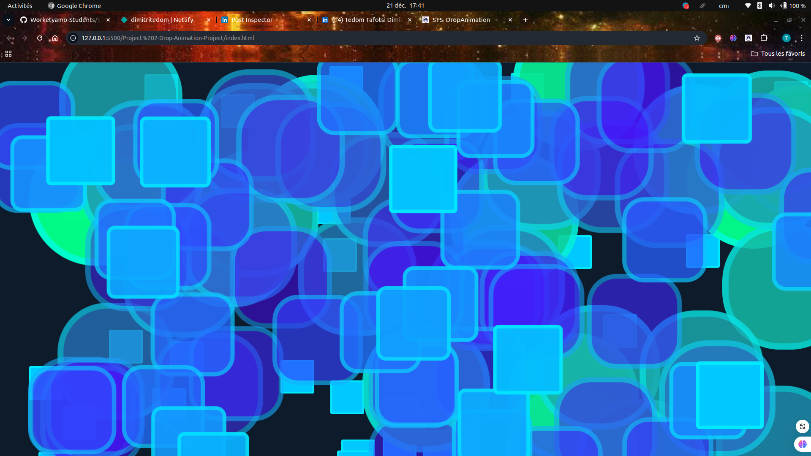

# STS_Drop_Animation

**STS_Drop_Animation** est un projet de drop animation qui combine des effets visuels dynamiques en CSS et JavaScript pour créer une expérience visuelle moderne et interactive. Ce projet est idéal pour les développeurs qui souhaitent explorer les animations front-end et les effets de transformation.


## 🚀 **Aperçu du projet**

Ce projet génère aléatoirement des gouttes animées qui évoluent dans leur apparence grâce à des transformations CSS. Chaque goutte passe par plusieurs états d'animation (changement de taille, de forme et de couleur) pour donner un effet fluide et attractif.


## 📋 **Technologies utilisées**

- **HTML5** : Structure de la page web.
- **CSS3** : Styles et animations pour les gouttes.
- **JavaScript (ES6)** : Dynamique des gouttes générées aléatoirement.
- **Git** : Versionnement du code.


## 🎨 **Fonctionnalités**

1. Génération aléatoire des gouttes sur l'écran.
2. Animation fluide avec des effets de transformation CSS :
   - Changements de **taille** et **forme**.
   - Transition des **couleurs** pour des rendus dynamiques.
3. Suppression automatique des gouttes pour éviter l'encombrement.


## 🖥️ **Installation et utilisation**

1. Clone le projet depuis le dépôt GitHub :  

```bash
git clone https://github.com/DimitriTedom/STS_DropAnimation.git
```

2. Ouvre le fichier **index.html** dans un navigateur.

3. Profite de l'animation en temps réel ! 🎉

---

## 🧩 **Structure du projet**

```plaintext
STS_Drop_Animation/
│
├── assets/
│   ├── style.css       # Feuille de styles CSS
│   └── script.js       # Fichier JavaScript pour la logique dynamique
│
├── index.html          # Page principale
└── README.md           # Documentation du projet
```

---

## 📷 **Capture d'écran**



---

## 🌟 **Auteur**

**Dimitri Wilfried Tedom Tafotsi**

- **GitHub** : [Dimitri-Tedom](https://github.com/Dimitri-Tedom)  
- **LinkedIn** : [Dimitri Tedom](https://www.linkedin.com/in/tedom-tafotsi-dimitri-wilfried-b70502298/)  
- **E-mail** : [wilfried.tedom@facsciences-uy1.cm](mailto:wilfried.tedom@facsciences-uy1.cm)

---

## 🤝 **Contributions**

Les contributions sont les bienvenues ! Si tu souhaites améliorer le projet, n'hésite pas à :

1. **Forker** ce dépôt.
2. Créer une nouvelle **branche** : `git checkout -b feature/NouvelleFonctionnalite`.
3. Faire un **commit** : `git commit -m "Ajout d'une nouvelle fonctionnalité"`.
4. Envoyer une **pull request**.

---

## ⭐ **Support**

Si ce projet t'a été utile, laisse une ⭐ sur le dépôt GitHub pour soutenir mon travail !

---

## 📫 **Contact**

Pour toute question ou suggestion, tu peux me contacter via :

- **E-mail** : [wilfried.tedom@facsciences-uy1.cm](mailto:wilfried.tedom@facsciences-uy1.cm)  
- **LinkedIn** : [Dimitri Tedom](https://www.linkedin.com/in/tedom-tafotsi-dimitri-wilfried-b70502298/)

---

Merci d'avoir exploré **STS_Drop_Animation**. J'espère que ce projet t'inspirera dans tes futures créations ! 😊
